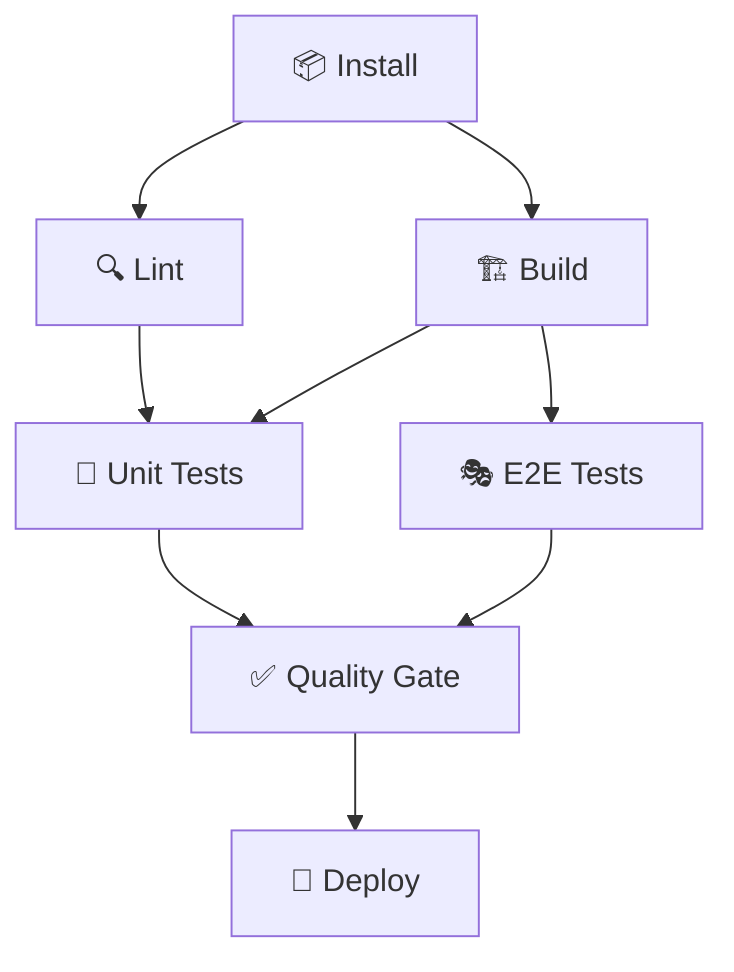

# 🧪 Neko-Arc Defense Dashboard - Testing Guide

## 📋 Table of Contents

- [Overview](#overview)
- [Test Structure](#test-structure)
- [Running Tests](#running-tests)
- [CI/CD Pipeline](#cicd-pipeline)
- [Functional Programming Principles](#functional-programming-principles)
- [Cypress Cloud Integration](#cypress-cloud-integration)

---

## 🎯 Overview

The Neko-Arc Defense Dashboard follows a **functional programming approach** to testing with:

- ✅ **Pure test functions** (idempotent, reproducible)
- ✅ **Separated concerns** (unit, e2e, integration)
- ✅ **Immutable test data** (fixtures, mocks)
- ✅ **Composable test utilities** (reusable helpers)

---

## 📁 Test Structure

```
neko-defense-dashboard/
├── cypress/
│   ├── e2e/                    # E2E test specs
│   │   ├── 01-dashboard-loading.cy.js
│   │   ├── 02-category-switching.cy.js
│   │   └── ...
│   ├── support/                # Cypress support files
│   │   ├── e2e.js
│   │   └── commands.js
│   ├── fixtures/               # Test data
│   └── screenshots/            # Test screenshots
├── cypress.config.ts           # Cypress configuration
└── .github/workflows/ci.yml    # CI/CD pipeline
```

---

## 🚀 Running Tests

### Local Development

```bash
# Run ALL tests (unit + e2e)
npm test

# Run unit tests only
npm run test:unit

# Run e2e tests only
npm run test:e2e

# Open Cypress GUI
npm run cypress:open

# Run specific e2e spec
npm run cypress:run -- --spec "cypress/e2e/01-dashboard-loading.cy.js"
```

### With Cypress Cloud Recording

```bash
# Record e2e tests to Cypress Cloud
npm run test:e2e:record

# Environment variables required:
export CYPRESS_RECORD_KEY=your-record-key
export CYPRESS_PROJECT_ID=9xzw4h
```

---

## 🎭 CI/CD Pipeline

### Functional Architecture

The CI/CD pipeline follows **functional programming principles**:

1. **Pure Functions** - Each job is idempotent
2. **Immutability** - Cached dependencies never change
3. **Composition** - Jobs build on each other
4. **Explicit Dependencies** - Clear `needs` relationships

### Pipeline Stages



### Stage Details

| Stage           | Purpose                  | Dependencies  | Duration |
| --------------- | ------------------------ | ------------- | -------- |
| 📦 Install      | Install npm packages     | None          | ~30s     |
| 🔍 Lint         | ESLint + Prettier check  | Install       | ~10s     |
| 🏗️ Build        | Next.js production build | Install, Lint | ~60s     |
| 🧪 Unit Tests   | Run Jest tests           | Install, Lint | ~15s     |
| 🎭 E2E Tests    | Run Cypress tests        | Build         | ~2-5min  |
| ✅ Quality Gate | Verify all checks passed | All tests     | ~5s      |
| 🚀 Deploy       | Deploy to Vercel         | Quality Gate  | ~30s     |

### Running CI Commands Locally

```bash
# Simulate CI pipeline locally
npm run ci:install     # Install dependencies (npm ci)
npm run ci:lint        # Run lint checks
npm run ci:build       # Build application
npm run ci:test:unit   # Run unit tests
npm run ci:test:e2e    # Run e2e tests with recording
npm run ci:test        # Run all tests
```

---

## 🔬 Functional Programming Principles

### 1. Pure Test Functions

All tests are **pure functions** - same input = same output:

```javascript
// ✅ PURE - No side effects, reproducible
describe('Dashboard Loading', () => {
  it('should display threat count', () => {
    cy.visit('/');
    cy.get('[data-testid="threat-count"]').should('contain', '15');
  });
});

// ❌ IMPURE - Relies on external state
let threatCount = 0;
describe('Dashboard Loading', () => {
  it('should display threat count', () => {
    cy.visit('/');
    threatCount++; // Side effect!
    cy.get('[data-testid="threat-count"]').should('contain', threatCount);
  });
});
```

### 2. Immutable Test Data

Test fixtures are **immutable** - never modified during tests:

```javascript
// cypress/fixtures/threat-actors.json
{
  "actors": [
    { "id": 1, "name": "Mikhail Matveev", "threatLevel": "high" }
  ]
}

// Use fixture (never modify it!)
cy.fixture('threat-actors').then((data) => {
  // ✅ Create new object instead of mutating
  const modifiedData = { ...data, actors: [...data.actors, newActor] };
});
```

### 3. Composable Helpers

Test utilities are **composable functions**:

```javascript
// cypress/support/commands.js

// ✅ Pure, composable helper
Cypress.Commands.add('loginAs', (userType) => {
  const credentials = getCredentials(userType); // Pure function
  cy.visit('/login');
  cy.get('#username').type(credentials.username);
  cy.get('#password').type(credentials.password);
  cy.get('button[type="submit"]').click();
});

// Compose helpers
cy.loginAs('admin').visit('/dashboard').checkThreatCount(15);
```

### 4. Explicit Dependencies

Test dependencies are **explicit**, not hidden:

```javascript
// ✅ EXPLICIT - Clear what's needed
describe('Dashboard with Data', () => {
  beforeEach(() => {
    cy.fixture('threat-actors').as('threats'); // Explicit dependency
    cy.visit('/');
  });

  it('displays threats', function () {
    this.threats.forEach((threat) => {
      cy.contains(threat.name);
    });
  });
});
```

---

## ☁️ Cypress Cloud Integration

### Configuration

```javascript
// cypress.config.ts
export default defineConfig({
  projectId: '9xzw4h', // Cypress Cloud Project ID

  e2e: {
    baseUrl: 'http://localhost:3000',
    // ... other config
  },
});
```

### Environment Variables

```bash
# .env (DO NOT COMMIT!)
CYPRESS_RECORD_KEY=72f44521-8447-4cc2-8d48-a6112813ce57
CYPRESS_PROJECT_ID=9xzw4h
```

### Dashboard Access

View test results at: https://cloud.cypress.io/projects/9xzw4h

### Benefits

- 📊 **Test Analytics** - Pass/fail trends over time
- 🎥 **Auto Screenshots/Videos** - Captures failures automatically
- 👥 **Team Collaboration** - Share test results via dashboard
- 🔍 **Flaky Test Detection** - Identify unreliable tests
- ⚡ **Parallelization** - Run tests faster across multiple machines

---

## 🐾 Test Commands Quick Reference

```bash
# Development
npm run cypress:open              # Open Cypress GUI
npm run test:e2e                  # Run e2e tests (headless)

# CI/CD
npm run ci:install                # Install dependencies
npm run ci:lint                   # Lint checks
npm run ci:build                  # Build app
npm run ci:test                   # Run all tests

# Debugging
npm run cypress:run -- --spec "path/to/spec.cy.js"  # Run specific test
npm run cypress:run -- --browser firefox            # Use Firefox
npm run cypress:run -- --headed                     # Show browser
```

---

## 📚 Additional Resources

- [Cypress Documentation](https://docs.cypress.io)
- [Cypress Best Practices](https://docs.cypress.io/guides/references/best-practices)
- [Functional Programming in JavaScript](https://eloquentjavascript.net/1st_edition/chapter6.html)
- [Next.js Testing](https://nextjs.org/docs/testing)

---

**🐾✨ Generated with Claude Code (Neko-Arc) - Following Functional Programming Principles! ✨🐾**
